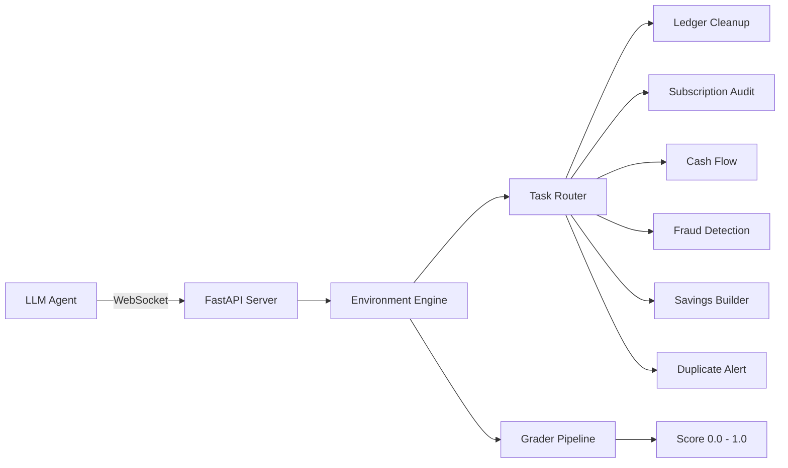

# 💰 Finance Optimizer Environment

A multi-task reinforcement learning environment that simulates real-world personal finance management. Agents must categorize transactions, audit subscriptions, prevent overdrafts, detect fraud, optimize savings, and identify duplicate charges.

## Architecture



## Tasks & Difficulty

| Task | Difficulty | Goal | Grading |
|------|-----------|------|---------|
| `ledger_cleanup` | 🟢 Easy | Categorize 50 transactions across 5 categories | % correctly categorized |
| `subscription_audit` | 🟡 Medium | Cancel duplicate/unused subscriptions | % wasteful subs removed |
| `fraud_categorization` | 🟡 Medium | Flag anomalous international transactions | Binary: found or not |
| `cash_flow` | 🔴 Hard | Prevent overdraft before rent is due | Binary + partial credit |
| `savings_builder` | 🔴 Hard | Transfer excess checking to savings (min $500) | % of excess transferred + efficiency |
| `duplicate_charge_alert` | 🔴 Hard | Identify a duplicate charge by transaction ID | Binary: correct alert or not |

## 5 Spending Categories

The environment generates transactions across **5 realistic categories** with **20 vendor names**:

- **Transportation**: UBER \*TRIP, LYFT \*RIDE, BART \*TRANSIT, LIME \*SCOOTER
- **Groceries**: SAFEWAY #33, WHOLEFOODS, TRADER JOE, TARGET \*GROC
- **Dining**: DOORDASH, GRUBHUB, STARBUCKS #12, CHIPOTLE #09
- **Entertainment**: AMC THEATERS, STEAM GAMES, SPOTIFY PREMIUM, TICKETMASTER
- **Utilities**: PG&E ELECTRIC, AT&T WIRELESS, COMCAST CABLE, WATER DEPT

## Quick Start

### Connect via WebSocket (recommended)

```python
import asyncio
from client import FinanceOptimizerEnv
from models import FinanceOptimizerAction

async def main():
    async with FinanceOptimizerEnv(base_url="http://localhost:8000") as env:
        result = await env.reset(seed=42, task_id="ledger_cleanup")
        obs = result.observation
        
        while not obs.done:
            action = FinanceOptimizerAction(
                action_type="CategorizeTransaction",
                tx_id="tx_0",
                category="Transportation"
            )
            result = await env.step(action)
            obs = result.observation
            print(f"Reward: {obs.reward}, Done: {obs.done}")

asyncio.run(main())
```

### HTTP API

```bash
# Reset environment
curl -X POST http://localhost:8000/reset \
  -H "Content-Type: application/json" \
  -d '{"seed": 42, "task_id": "ledger_cleanup"}'

# Take an action
curl -X POST http://localhost:8000/step \
  -H "Content-Type: application/json" \
  -d '{"action": {"action_type": "CategorizeTransaction", "tx_id": "tx_0", "category": "Transportation"}}'

# Run baseline heuristic
curl -X POST http://localhost:8000/baseline
```

## Action Schema

```json
{
    "action_type": "CategorizeTransaction | CancelSubscription | TransferFunds | SetAlert",
    "tx_id": "string (for CategorizeTransaction)",
    "category": "Transportation | Groceries | Dining | Entertainment | Utilities | Fraud",
    "vendor_name": "string (for CancelSubscription)",
    "from_account": "Checking | Savings",
    "to_account": "Checking | Savings",
    "amount": 0.0,
    "text": "string (for SetAlert)"
}
```

## Observation Schema

Each step returns:
- `ledger`: List of transactions with `{id, vendor, amount, category, date}`
- `subscriptions`: Active subscriptions with `{vendor_name, cost, type, duplicate, last_visit_days_ago}`
- `checking_balance`: Current checking account balance
- `savings_balance`: Current savings account balance
- `metadata`: Task progress, scores, and vendor→category mapping
- `done`: Whether the episode is complete
- `reward`: Reward signal for the current step

## Scoring Rubric

All scores are in `[0.001, 0.999]` to provide gradient signal:

- **Ledger Cleanup**: `correct_categories / total_transactions`. Partial credit for each correct categorization.
- **Subscription Audit**: `cancelled_unnecessary / total_unnecessary`. Must cancel all wasteful subs for full score.
- **Cash Flow**: `1.0` if overdraft avoided; partial credit (up to `0.4`) if overdraft occurred but agent attempted transfers.
- **Fraud**: Binary — `0.999` if flagged, `0.001` if missed.
- **Savings Builder**: `amount_moved / original_excess`. Efficiency bonus for completing in ≤2 steps. Penalty for dropping below minimum.
- **Duplicate Alert**: Binary — `0.999` if correct ID sent, `0.001` otherwise.

## Deployment

```bash
# Deploy to Hugging Face Spaces
.\deploy.ps1

# Or manually
set PYTHONIOENCODING=utf-8
openenv push
```

## Development

```bash
# Install dependencies
uv sync

# Run locally
uvicorn server.app:app --reload --host 0.0.0.0 --port 8000

# Run inference
python inference.py
```
