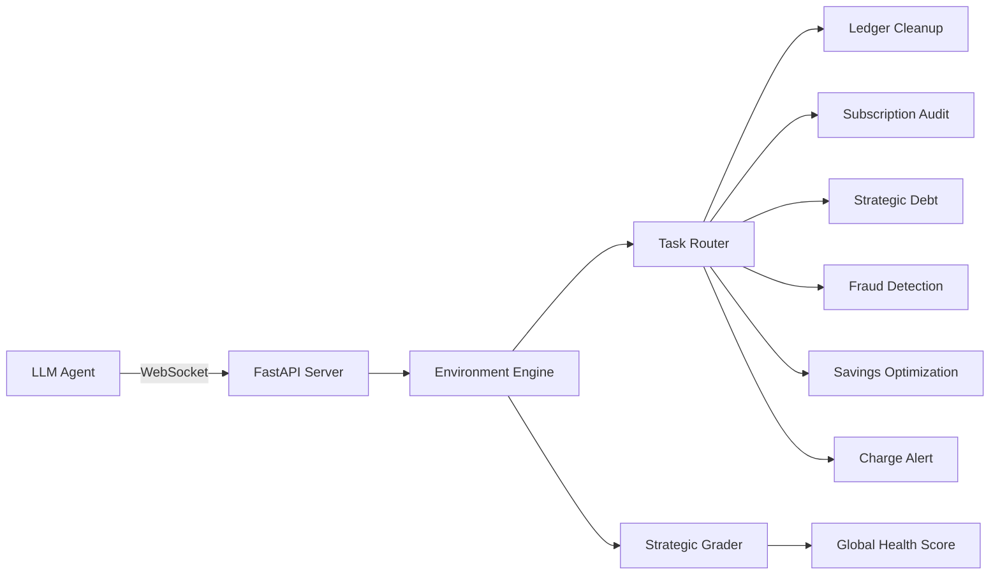

# 💰 Finance Optimizer Environment

A high-fidelity, multi-task reinforcement learning environment for strategic personal finance management. Built for the OpenEnv platform.

## Architecture



## Features for Hackathon Judges
- **Strategic Decision Making**: New "Debt Avalanche" task requiring mathematical APR vs ROI trade-offs.
- **Dynamic Adaptive Events**: Mid-episode random life events (Tax refunds, car repairs) that test agent robustness.
- **Global Financial Health Score**: Blended scoring (80% task success, 20% Net Worth growth) to reward wise long-term behavior.
- **Deep Procedural Randomization**: 20+ vendors, 5 categories, and randomized subscription pools.

## Tasks & Difficulty

| Task | Difficulty | Goal | Key Constraint |
|------|-----------|------|----------------|
| `ledger_cleanup` | 🟢 Easy | Categorize 50 transactions | 5 unique categories |
| `subscription_audit` | 🟡 Medium | Cancel duplicate/unused subs | Randomized usage pool |
| `fraud_categorization` | 🟡 Medium | Flag anomalous transactions | Anomaly detection |
| `cash_flow` | 🔴 Hard | Prevent overdraft | Fixed Rent due date |
| `savings_builder` | 🔴 Hard | Transfer excess to savings | Maintain $500 buffer |
| `debt_avalanche` | 🟣 Extreme | Pay off 22% APR card debt | ROI vs APR logic |
| `duplicate_charge_alert` | 🔴 Hard | Identify exact duplicate ID | Pattern matching |

## 5 Spending Categories
- **Transportation**: UBER, LYFT, BART, LIME.
- **Groceries**: SAFEWAY, WHOLEFOODS, TRADER JOE, TARGET.
- **Dining**: DOORDASH, GRUBHUB, STARBUCKS, CHIPOTLE.
- **Entertainment**: AMC, STEAM, SPOTIFY, TICKETMASTER.
- **Utilities**: PG&E, AT&T, COMCAST, WATER.

## 📈 Scoring & Benchmarking
The environment includes a built-in benchmarking suite:
```bash
# Run local benchmark & generate EVALUATION_REPORT.md
python benchmark_models.py
```

### Global Health Blended Score
Evaluation isn't just about the task—it's about the **Net Worth**. Scores are calculated as:
`Score = (0.8 * Task_Success) + (0.2 * Financial_Health_Metrics)`

Financial health includes:
1. **Net Worth Growth**: Percentage increase in (Cash - Debt).
2. **Debt Reduction**: Percentage of high-interest debt eliminated.
3. **Execution Efficiency**: Ratio of successful actions to total steps.

## Quick Start

```python
async with FinanceOptimizerEnv(base_url="http://localhost:8000") as env:
    result = await env.reset(seed=42, task_id="debt_avalanche")
    obs = result.observation
    
    # Strat: Pay card from Checking, leaving $500 buffer
    if obs.checking_balance > 500:
        await env.step(FinanceOptimizerAction(
            action_type="PayCreditCard",
            from_account="Checking",
            amount=obs.checking_balance - 500
        ))
```

## Deployment
```bash
# Fully verified for Hugging Face Spaces
.\deploy.ps1
```
