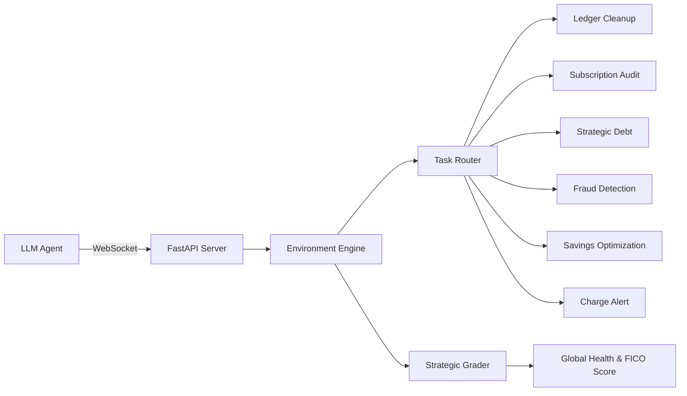

# Finance Optimizer Environment

A high-fidelity, multi-task reinforcement learning environment for strategic personal finance management. Built to evaluate the reasoning limits of frontier agents.

## Hackathon Elite Status
This environment is optimized for OpenEnv Hackathon 2026 with a focus on:
- Real-World Utility: Simulates 5 categories, 22% APR debt, and a dynamic FICO Credit Score.
- Constraint Satisfaction: Hard tasks (Debt Avalanche) require balancing repayment with a mandatory $500 safety buffer.
- Dense Reward Shaping: Rewards are multi-objective; agents must prioritize task targets while maintaining financial stability.

## Architecture



## Advanced Mechanics
### 1. Dynamic Credit Score (300-850)
The environment implements a realistic FICO scoring loop:
- (Positive) Categorizing fraud properly, paying down debt.
- (Negative) Overdrafting (heavy penalty), carrying high-interest debt (light decay), violating the $500 checking safety net.

### 2. Global Health Blended Score
Evaluation is composite. Final scores are calculated as:
Score = (0.8 * Task_Success) + (0.2 * Financial_Health_Metrics)

Financial health includes:
- Net Worth Growth: Assets vs. Liabilities.
- Credit Stability: Final FICO score normalized.
- Debt Reduction: Success in eliminating liabilities.

## Tasks & Difficulty

| Task | Difficulty | Goal | Constraint |
|------|-----------|------|------------|
| ledger_cleanup | Easy | Categorize 50 transactions | 5 unique categories |
| subscription_audit | Medium | Cancel unused subs | 12 selected services |
| fraud_categorization | Medium | Flag anomaly as Fraud | High-precision required |
| cash_flow | Hard | Prevent overdraft | Fixed Rent due date |
| savings_builder | Hard | Build Savings buffer | Min $500 in Checking |
| debt_avalanche | Extreme | Pay off 22% APR card | Mandatory $500 buffer |
| duplicate_charge_alert | Hard | Identify exact duplicate ID | String pattern matching |

## Benchmarking
```bash
# Generate EVALUATION_REPORT.md
python benchmark_models.py
```

## Quick Start (Strategic)
```python
# Strategy: Pay card from Checking only IF checking > $500 buffer
if obs.checking_balance > 500:
    payment = min(obs.credit_card_balance, obs.checking_balance - 500)
    await env.step(FinanceOptimizerAction(
        action_type="PayCreditCard",
        from_account="Checking",
        amount=payment
    ))
```
